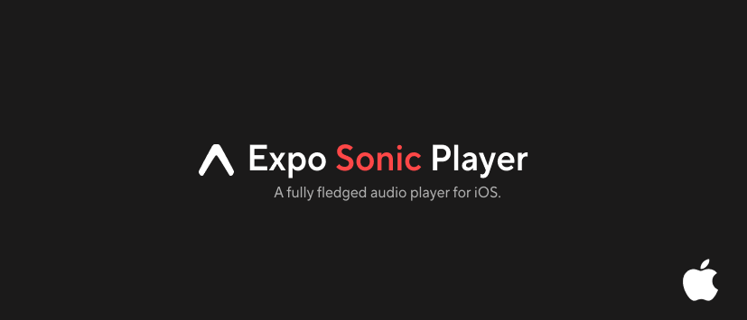

<div align="center">
  
</div>

<h1 align="center">
  <a href="https://github.com/rit3zh/glow-ui" target="_blank" rel="noopener noreferrer">
    💅
  </a>
</h1>

<p align="center">
  <!-- <strong>Glow UI</strong><br> -->
  Effortless design. Flawless components. Shine bright with every interface with Glow UI.
</p>

<div align="center">
  <p>

  
  
  
      
    
    
    
    <a href="https://www.buymeacoffee.com/rit3zh" target="_blank">
    
  </a>
  </p>

<p align="center">
  
</p>
</div>

# 🚀 Sonic Player – Native Audio Power for Expo

**Sonic Player** is a high-performance iOS audio engine tailored for modern React Native apps. Powered by `AVAudioEngine`, `AVPlayer`, and real-time native capabilities, it brings you ultra-low latency playback, dynamic audio filters, and blazing performance—perfect for music, podcast, or streaming apps.

---

## ✨ Features

- 🎧 **Spatial Audio** – Surround sound experience (iOS 15+)
- 🎚 **Real-Time Filters** – EQ, reverb, delay, and more with native audio nodes
- 📡 **Live Streaming** – Stream remote audio with minimal latency
- 🎛 **Filter Presets** – Prebuilt audio environments, switch instantly
- ⚡ **Optimized Performance** – Fast response & efficient memory usage
- 📁 **Multi-Format Support** – Supports MP3, AAC, WAV, FLAC & more
- 📦 **Chunked Playback** – Instant audio rendering in segments
- 📱 **Built for Expo** – Drop-in for Expo apps using Expo Modules API
- 🛠 **Production Ready** – Stable, lightweight, and customizable

## 📚 Documentation

Check out the [full documentation](https://glow-ui.vercel.app/) to learn how to install, configure, and use Sonic Player in your projects.

---

## 🤔 Why Sonic Player?

> Most audio libraries offer limited control over playback internals. Sonic Player gives **full native power** while maintaining a **declarative React Native experience**. Designed for performance-critical use cases, from podcasts to real-time audio manipulation apps.

---

## 🛠 Installation

```sh
npx expo install expo-sonic
```

### iOS Setup

> Sonic Player requires iOS 13+ and configures native modules automatically via `expo-modules-autolinking`.

Make sure to run:

```sh
npx pod-install
```

---

## 🤝 Contributing

We welcome contributions from the community!
Read our [contributing guidelines](CONTRIBUTING.md) to get started.

---

## 📝 License

MIT © [Sonic Player](https://github.com/rit3zh)

---

<div align="center">
  Made with ❤️ by <a href="https://github.com/rit3zh" target="_blank">rit3zh</a>
</div>
